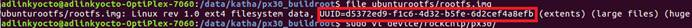
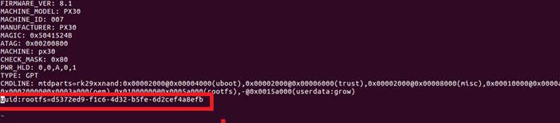
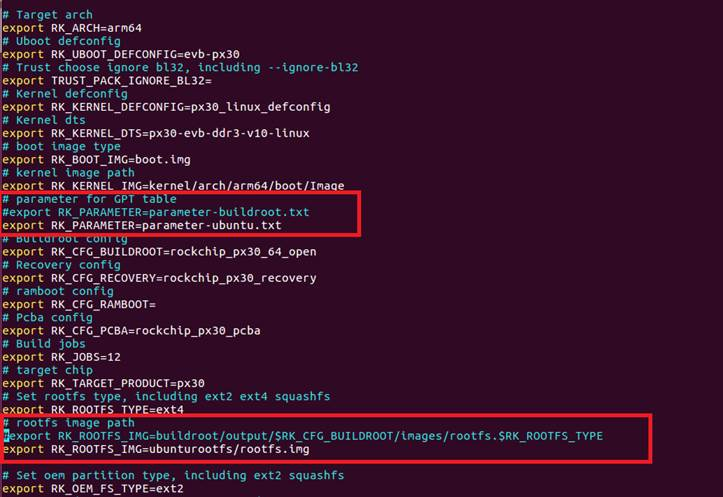
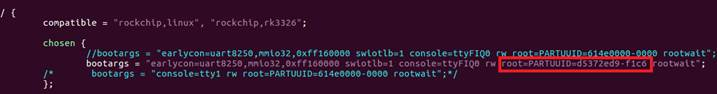

title: How to Build Ubuntu
---


### Getting Started

The procedure to describes how to create Ubuntu Root File System(RFS) image on **IPi-SMARC with LEC-PX30**


#### **Prerequisites**

1. Install QEMU on the development host PC with Ubuntu OS

   ```
   $ sudo apt-get install qemu-user-static
   ```

2. Download Ubuntu 18.04 base from http://cdimage.ubuntu.com/ubuntu-base/releases/18.04/release/   and choose this one: `ubuntu-base-18.04.1-base-arm64.tar.gz`

3. Create a temporary folder for decompression after download.

   ```
   $ mkdir temp
   $ sudo tar -xpf ubuntu-base-18.04.1-base-arm64.tar.gz -C temp
   ```


#### Configure the rootfs

1. Get your network ready

   ```
   $ sudo cp -b /etc/resolv.conf temp/etc/resolv.conf
   ```

2. Prepare QEMU.

   ```
   $ sudo cp /usr/bin/qemu-aarch64-static temp/usr/bin/
   ```

3. Change root

   ```
   $ sudo chroot temp
   ```

4. Update and upgrade

   ```
   $ apt update
   $ apt upgrade
   ```

5. Install the required tools or utilities.

   ```
   $ apt install vim git sudo net-tools ifupdown kmod
   ```

6. Enable serial console

   ```
   $ ln -s /lib/systemd/system/getty\@.service /etc/systemd/system/getty.target.wants/serial-getty@ttyS0.service
   ```

7. Add user name

   ```
   $ useradd -s '/bin/bash' -m -G adm,sudo adlink
   ```

8. Set user’s password.

   ```
   $ passwd adlink
   ```

9. Set the root user’s password.

   ```
   $ passwd root
   ```

10. After all the work is done, exit.

    ```
    $ exit
    ```


#### Make the Root File System

Execute the commands below to make the rootfs. Notice that you need change the “count” value according to the size of the “temp” folder.

    $ dd if=/dev/zero of=rootfs.img bs=1M count=2048
    $ sync
    $ sudo mkfs.ext4 rootfs.img
    $ mkdir rootfs
    $ sudo mount rootfs.img rootfs*
    $ sudo cp -rfp temp/* rootfs/
    $ sudo umount rootfs/
    $ e2fsck -p -f rootfs.img
    $ resize2fs -M roofs.img

 The final root files system rootfs.img is ready.


#### Binding Ubuntu rootfs Image to PX30 Buildroot Linux

The procedure to describes how to bind Ubuntu rootfs image to LEC-PX30 Buildroot Linux

1. Download LEC-PX30 Buildroot SDK and extract it.

   ​    **Note**: kernel branch is `Cariboard-base-2.0`  and use `root` account for the building.

2. Change directory to px30_buildroot.

   ```
   $ cd px30_buildroot
   ```

3. Create a temporary directory.

   ```
   $ mkdir ubunturootfs
   ```

4. Copy the created rootfs.img to ubunturootfs.

   ```
   $ cp /path/to/ubuntu/rootfs.img ubunturootfs
   ```

5. Create a parameter-ubuntu.txt file under device/rockchip/px30 folder.

   ```
   $ cp device/rockchip/px30/parameter-buildroot.txt device/rockchip/px30/parameter-ubuntu.txt
   ```

6. Get UUID of rootfs image

   ```
   $ file ubunturootfs/rootfs.img
   ```



7. modify UUID you get for `parameter-ubuntu.txt` file

   ```
   $ vi device/rockchip/px30/parameter-ubuntu.txt
   ```



8. Open BoardConfig_open.mk file and change the path for parameter.txt and rootfs.img files.

   ```
   $ sudo vi device/rockchip/px30/BoardConfig_open.mk
   ```



9. Open rk3326.dtsi file and add new part UUID.

   ```
   $ sudo vi kernel/arch/arm64/boot/dts/rockchip/rk3326-linux.dtsi
   ```



10. Run build.sh, it will generate update.img under rockdev folder.

    ```
    $ sudo ./build.sh
    ```
