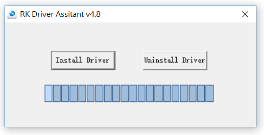
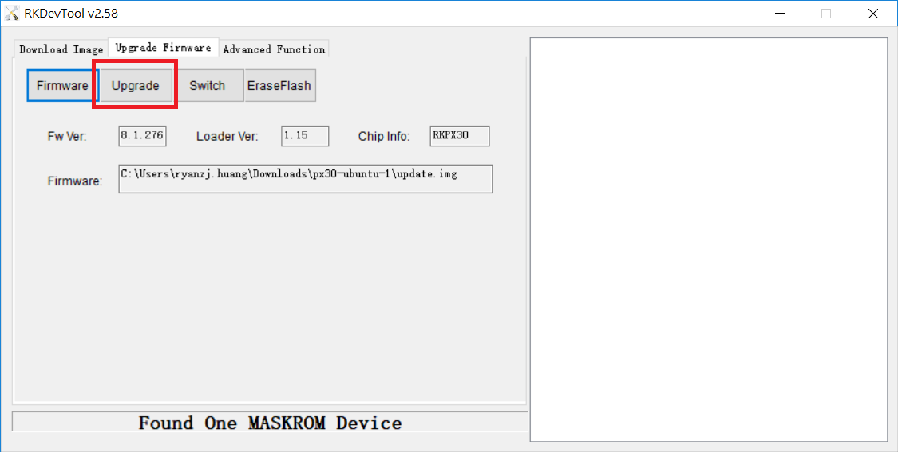

title: How to Flash Yocto Image
---
 

There is no need to install a device driver under Linux. You can connect to the device by referring to the Windows chapter.


### Booting Linux from eMMC

This procedure describes how to install Yocto images to eMMC on LEC-PX30 module with IPi-SMARC

**Note:** All of files will be erased on eMMC.


#### Under Linux environment:

##### 1. Prerequisites

- Rockchip provides the flashing tool under Linux and please download from [Rockchip GitHub](https://github.com/rockchip-linux/tools/tree/master/linux/Linux_Upgrade_Tool)

  Unzip it and you will get a file called **upgrade_tool** which is a binary executable file under Linux.

##### 2. Here is the procedure

1. Connect LEC-PX30 with IPi-SMARC board to the development Host PC by using MicroUSB cable

2. Please configure the board to **MASKROM Mode**

3. Please issue the following commands for flashing image:

```
$ sudo ./upgrade_tool uf update.img
```

**Note**: Here is the command to erase the flash if need

```
$ sudo ./upgrade_tool ef update.img
```


#### Under Windows environment:

##### 1. Prerequisites

- Download [DriverAssitant.zip](https://github.com/rockchip-linux/tools/tree/master/windows) and then install it on the development Host PC.

  

- Rockchip provides the flashing tool under Windows and please download **AndroidTool** from [Rockchip GitHub](https://github.com/rockchip-linux/tools/tree/master/windows/AndroidTool).

- After download, extract it and locate the file named config,ini to modify the language to English from "Selected=1" to "Selected=2"

  


  **Note**:  Selected=1 (Chinese Language), Selected=2 (English)


##### 2. Here is the procedure

1. Connect LEC-PX30 with IPi-SMARC board to the development Host PC by using MicroUSB cable
2. Please configure the board to **MASKROM** Mode and also check if the current status is **Found One MASKROM Device** on AndroidTool.


3. Then, choose the tab of Upgrade Firmware on AndroidTool and click "Firmware button" to selec the image you build


4. Then, click "Upgrade button" to start to flash to eMMC until the process completion.


