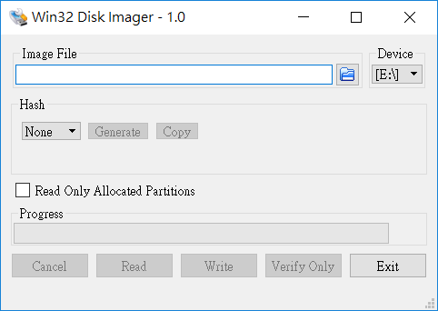
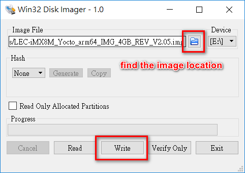

title: How to flash image to SD Card
---

The procedure to describes how to flash the image to the MicroSD Card


### Prerequisites

- Copy the prebuilt bootable Linux image to the working directory on your development host.

  **Note**: if you don't have images, please go to here for the download

- For Windows environment, please download and Install [Win32DiskImager](https://sourceforge.net/projects/win32diskimager/) to flash image to SD Card


### Here is the procedure

This procedure describes how to install u-boot, Linux kernel and filesystem images to MicroSD Card.

​       **Note:** All of files will be erased on MicroSD Card. The size should be at least 16 Gb.


##### For Windows environment:

1. Insert an empty MicroSD Card into development host and execute Win32DiskImager.exe as the below. Find out where your removable drive is mounted and check which mount point the drive is listed under. Here is an example of an SD card listed under **E:**




2. In the Image File box, choose .img that you copy previously and click on **Write button** and wait for the process until the completion.




3. Insert MicroSD Card with image to the Card holder of IPI-SMARC and configure the board for booting from the MicroSD Card.


##### For Linux environment:

1. Insert an empty MicroSD Card into development host and enter the following command to copy .img to MicroSD Card

   ```
   $ sudo dd if=[image name].img of=/dev/sd[x]
   ```

   **Note**: please look for the location of MicroSD card device, such as **/dev/sdb** or **/dev/sda**


2. After done, please enter the following command

   ```
   $ sync
   ```
