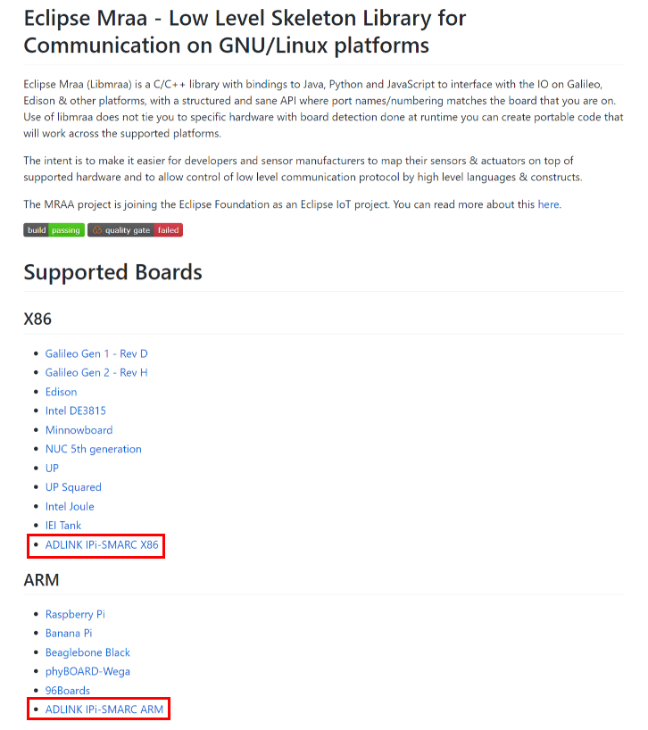

title: How to Install MRAA Library
---

Eclipse Mraa (Libmraa) is a C/C++ library with bindings to Java, Python and JavaScript to interface with the IO, with a structured and sensors API where port names/numbering matches the board that you are on. Use of libmraa does not tie you to specific hardware with board detection done at runtime you can create portable code that will work across the supported platforms.

The intent is to make it easier for developers and sensor manufacturers to map their sensors & actuators on top of supported hardware and to allow control of low level communication protocol by high level languages & constructs.

 
## Getting Started

​		Our MRAA libraries has been ready on [**Eclipse MRAA GitHub**]( https://github.com/eclipse/mraa) to support **LEC-PX30 & LEC-AL-AI with industrial Pi-SMARC** as the following screen:

Please refer to the following link to know the details of 40 pin mapping:

* [ADLINK IPi-SMARC ARM](https://github.com/eclipse/mraa/blob/master/docs/adlink_ipi_arm.md) (LEC-PX30 with Industrial Pi)
* [ADLINK IPi-SMARC x86](https://github.com/eclipse/mraa/blob/master/docs/adlink_ipi_x86.md) (LEC-AL-AI with Industrial Pi)

 
## How to Build MRAA on your boards:

Please refer to [here](https://github.com/eclipse/mraa/blob/master/docs/building.md) to guide you how to build MRAA
