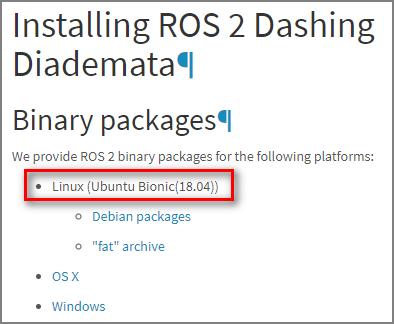
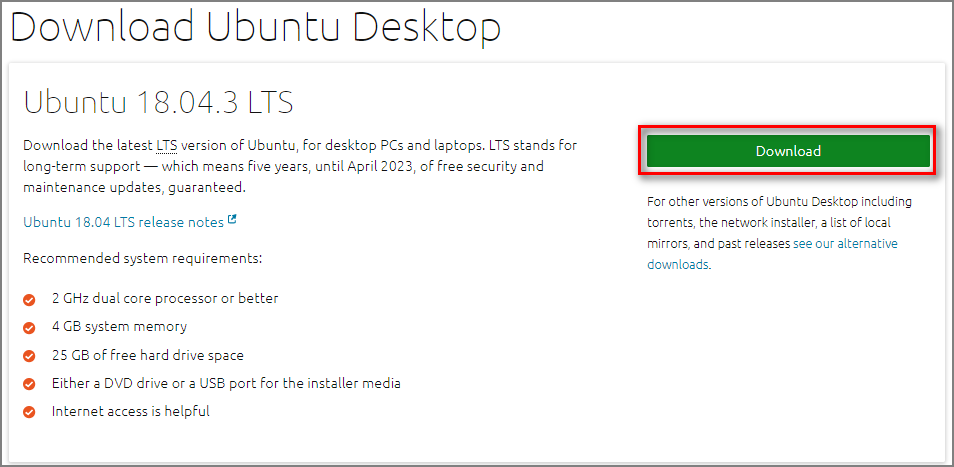
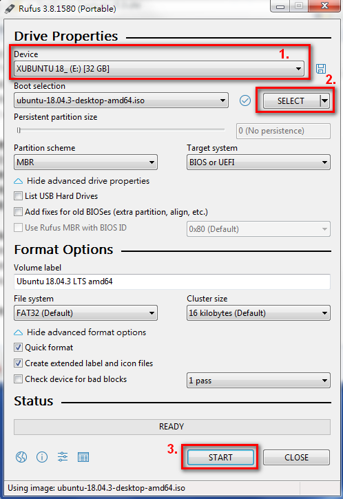
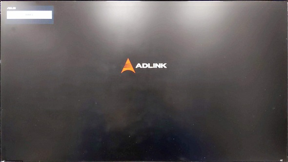
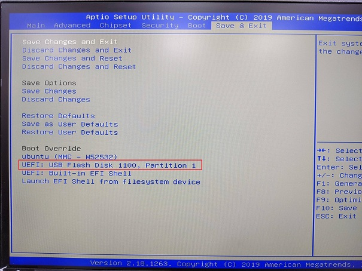
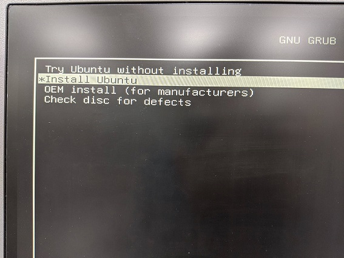

# Ubuntu Installation Guide

## Download Ubuntu Desktop image

Before downloading Ubuntu image, you have to ensure which ROS distribution you want to use, and then download the right Ubuntu distribution supporting the ROS distribution you choose.

For example, here we want to install ROS 2 Dashing, so we find the document from [ROS website](https://index.ros.org/doc/ros2/Installation/Dashing/) telling us that ROS 2 Dashing binary packages are supported on **Linux (Ubuntu Bionic(18.04))** platform.

Then we can download Ubuntu Desktop 18.04.3 LTS from [Ubuntu website](https://ubuntu.com/download/desktop).

## Create a bootable microSD card or USB stick

In order to create a bootable microSD card or USB stick for later installation, it's recommended to download [**Rufus**](https://rufus.ie/) and use it to flash your bootable media with Ubuntu image.

Below picture shows how to use Rufus, just select the right device and image, and then click `START` button to flash the selected device. For detailed instructions, please visit the [pages](https://tutorials.ubuntu.com/tutorial/tutorial-create-a-usb-stick-on-windows#1) from Ubuntu website.

## Install Ubuntu Desktop

Insert the bootable media you've created from previous section and then power on the system. Once you see ADLINK logo on screen, press `Delete` key to enter BIOS menu.

After you successfully enter BIOS menu, select the inserted media and then press `Enter` key to boot up from the bootable media.

If you choose the valid bootable media to boot up, you'll find the menu like below picture asking you what to do next.

From now on, you can install Ubuntu Desktop by following its installation wizard. For further informantion, please refer to [this tutorial](https://tutorials.ubuntu.com/tutorial/tutorial-install-ubuntu-desktop#4).
