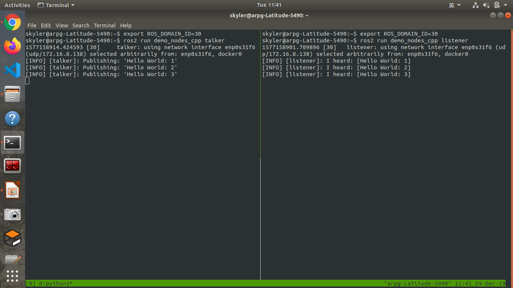
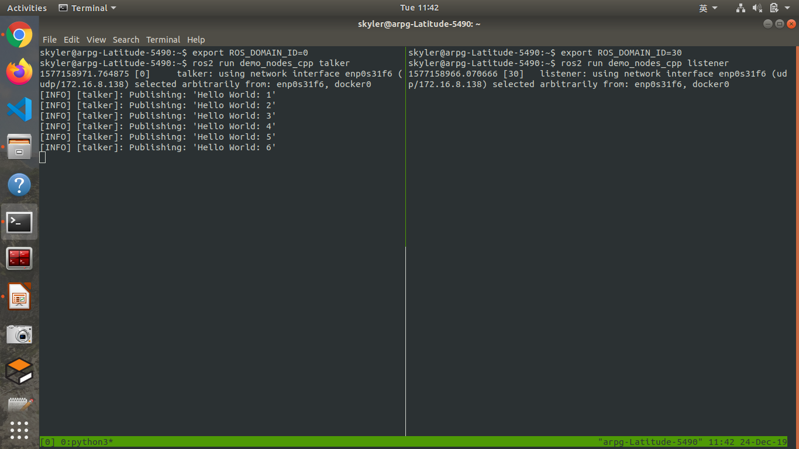

# ROS domain ID in ROS2

[ROS_DOMAIN_ID](https://index.ros.org/doc/ros2/Contributing/ROS-2-On-boarding-Guide/#get-a-personal-ros-domain-id) is an environment variable to separate the DDS domain. Topics can be interoperated in the same ROS domain. The default `ROS_DOMAIN_ID` in [ros_dotfiles](https://github.com/Adlink-ROS/ros_dotfiles) is **30**.

* Publisher and subscriptor in the same domain 
  
* Publisher and subscriptor in different domain 
  

