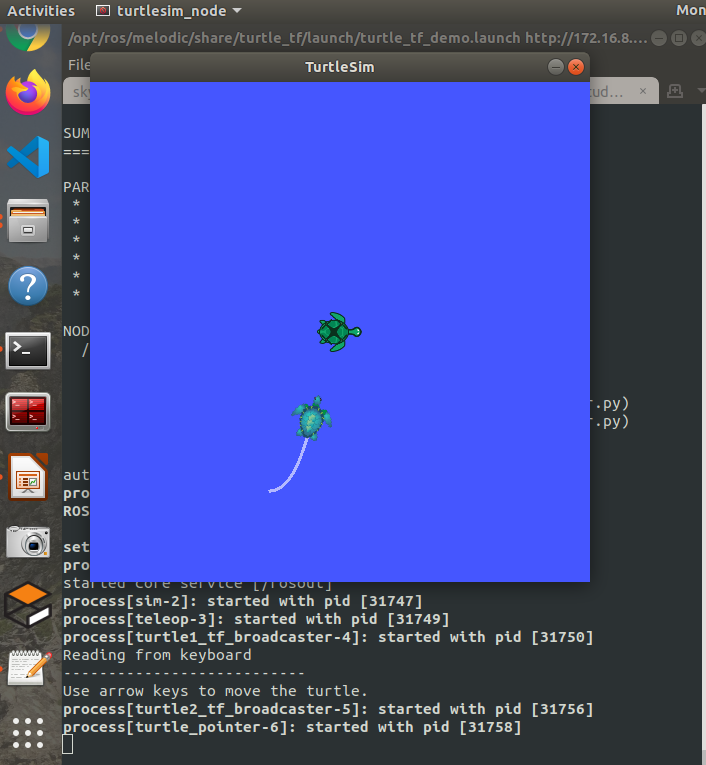

# Verify with turtlesim

[Turtlesim](http://wiki.ros.org/turtlesim) is a package made for teaching ROS and ROS packages. And [turtle_tf](http://wiki.ros.org/turtle_tf) is a package  demonstrating how to write a tf broadcaster and listener with the turtlesim. You can use turtle_tf to verify your ROS environment.

1. Install turtlesim and turtle_tf:
    ```bash
    $ sudo apt-get install -y ros-$(rosversion -d)-turtlesim*
    $ sudo apt-get install -y ros-$(rosversion -d)-turtle-tf*
    ```
1. Run turtle_tf:
    ```bash
    $ roslaunch turtle_tf turtle_tf_demo.launch
    ```
    

    You will see two turtles and you can  control the central one by using arrow keys. The second one will chase the turtle you are controlling.
 
